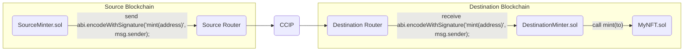
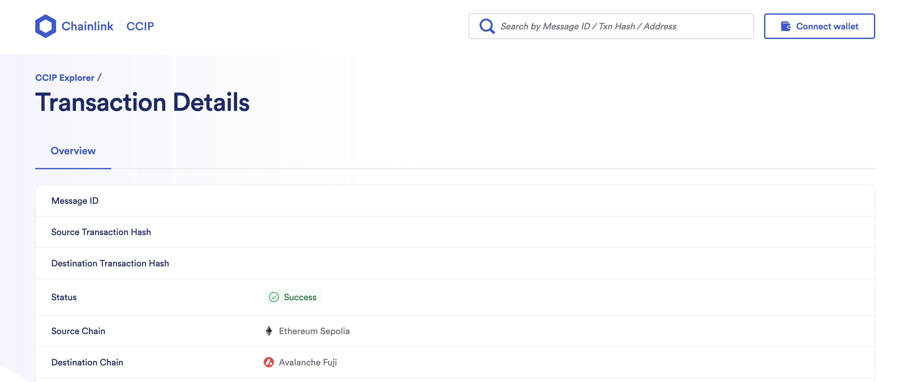

# CCIP Cross Chain NFT

> **Note**
>
> _This repository represents an example of using a Chainlink product or service. It is provided to help you understand how to interact with Chainlink’s systems so that you can integrate them into your own. This template is provided "AS IS" without warranties of any kind, has not been audited, and may be missing key checks or error handling to make the usage of the product more clear. Take everything in this repository as an example and not something to be copy pasted into a production ready service._

This project demonstrates how to mint an NFT on one blockchain from another blockchain using Chainlink CCIP.

This project was started from [CCIP's example](https://github.com/smartcontractkit/ccip-cross-chain-nft)

## Prerequisites

- [Git](https://git-scm.com/book/en/v2/Getting-Started-Installing-Git)
- [Current LTS Node.js version](https://nodejs.org/en/about/releases/)

Verify installation by typing:

```shell
node -v
```

and

```shell
npm -v
```

## Getting Started

1. Install packages

```
npm install
```

2. Compile contracts

```
npx hardhat compile
```

## What is Chainlink CCIP?

**Chainlink Cross-Chain Interoperability Protocol (CCIP)** provides a single, simple, and elegant interface through which dApps and web3 entrepreneurs can securely meet all their cross-chain needs, including token transfers and arbitrary messaging.


With Chainlink CCIP, one can:

- Transfer supported tokens
- Send messages (any data)
- Send messages and tokens

CCIP receiver can be:

- Smart contract that implements `CCIPReceiver.sol`
- EOA

**Note**: If you send a message and token(s) to EOA, only tokens will arrive

To use this project, you can consider CCIP as a "black-box" component and be aware of the Router contract only. If you want to dive deep into it, check the [Official Chainlink Documentation](https://docs.chain.link/ccip).

## What are we building?

Imagine that you want to go to a conference that sells tickets as NFTs on one chain, but you have funds on some other chain. You will need to bridge your tokens to that chain where the NFT contract exists, to mint the NFT, and optionally bridge funds back.

We are building the cross-chain NFT minting system. This project aims to mint an NFT on the destination blockchain, accepting payment, and sending the `to` address from the source blockchain. It is extremely simple so we can understand the basic concepts, but you can add extra features.

The basic architecture diagram of what we want to accomplish looks like this:



## Usage

There are several Hardhat tasks available for deployment and interaction with this project. But before that, you need to set up some environment variables.

1. Now set the following environment variables: `MNEMONIC`, Source Blockchain RPC URL, Destination Blockchain RPC URL. You can see available options in the `.env.example` file:

```shell
ETHEREUM_SEPOLIA_RPC_URL=""
OPTIMISM_GOERLI_RPC_URL=""
ARBITRUM_TESTNET_RPC_URL=""
AVALANCHE_FUJI_RPC_URL=""
POLYGON_MUMBAI_RPC_URL=""
MNEMONIC=""
```

Copy and paste the example to .env, and fill in the values.

### Deployment

1. Deploy the [`GameNFT.sol`](./contracts/GameNFT.sol) and [`DestinationMinter.sol`](./contracts/DestinationMinter.sol) smart contracts to the **destination blockchain**, by running the `deploy-destination-minter` task:

```shell
npx hardhat deploy-destination-minter
--router <routerAddress> # Optional
```

For example, if you want to mint NFTs on avalancheFuji, run:

```shell
npx hardhat deploy-destination-minter --network avalancheFuji
```

2. Deploy the [`EcosystemToken.sol`](./contracts/EcosystemToken.sol) and [`SourceMinter.sol`](./contracts/SourceMinter.sol) smart contract to the **source blockchain**, by running the `deploy-source-minter` task:

```shell
npx hardhat deploy-source-minter
--router <routerAddress> # Optional
--link <linkTokenAddress> # Optional
```

For example, if you want to mint NFTs on avalancheFuji by sending requests from ethereumSepolia, run:

```shell
npx hardhat deploy-source-minter --network ethereumSepolia
```

### Fee Management

3. Fund the [`SourceMinter.sol`](./contracts/SourceMinter.sol) smart contract with tokens for CCIP fees.

- If you want to pay for CCIP fees in Native tokens:

  Open Metamask and fund your contract with Native tokens. For example, if you want to mint from Ethereum Sepolia to Avalanche Fuji, you can send 0.01 Sepolia ETH to the [`SourceMinter.sol`](./contracts/SourceMinter.sol) smart contract.

  Or, you can execute the `fill-sender` task, by running:

```shell
npx hardhat fill-sender
--sender-address <sourceMinterAddress>
--blockchain <blockchain>
--amount <amountToSend>
```

For example, if you want to fund it with 0.01 Sepolia ETH, run:

```shell
npx hardhat fill-sender --sender-address <SOURCE_MINTER_ADDRESS> --blockchain ethereumSepolia --amount 10000000000000000
```

### Minting

4. Mint NFTs by calling the `mint()` function of the [`SourceMinter.sol`](./contracts/SourceMinter.sol) smart contract on the **source blockchain**. It will send the CCIP Cross-Chain Message with the ABI-encoded mint function signature from the [`GameNFT.sol`](./contracts/GameNFT.sol) smart contract. The [`DestinationMinter.sol`](./contracts/DestinationMinter.sol) smart contracts will receive the CCIP Cross-Chain Message with the ABI-encoded mint function signature as a payload and call the [`GameNFT.sol`](./contracts/GameNFT.sol) smart contract using it. The [`GameNFT.sol`](./contracts/GameNFT.sol) smart contract will then mint the new NFT to the `msg.sender` account from the `mint()` function of the [`SourceMinter.sol`](./contracts/SourceMinter.sol) smart contract, a.k.a to the account from which you will call the following command:

```shell
npx hardhat cross-chain-mint
--source-minter <sourceMinterAddress>
--source-blockchain <sourceBlockchain>
--destination-blockchain <destinationBlockchain>
--destination-minter <destinationMinterAddress>
```

For example, if you want to mint NFTs on Avalanche Fuji by sending requests from Ethereum Sepolia, run:

```shell
npx hardhat cross-chain-mint --source-minter <SOURCE_MINTER_ADDRESS> --source-blockchain ethereumSepolia --destination-blockchain avalancheFuji --destination-minter <DESTNATION_MINTER_ADDRESS>
```

5. Once the CCIP message is finalized on the destination blockchain, you can query the GameNFTs balance of your account, using the `balance-of` task:



```shell
npx hardhat balance-of
--gameNft <GameNFTContractAddress>
--blockchain <destinationBlockchain>
--owner <theAccountToCheckBalanceOf>
```

For example, to verify that the new MyNFT was minted, type:

```shell
npx hardhat balance-of --gameNft <MY_NFT_CONTRACT_ADDRESS> --blockchain avalancheFuji --owner <PUT_YOUR_EOA_ADDRESS_HERE>
```

Of course, you can see your newly minted NFT on popular NFT Marketplaces, like OpenSea for instance:


6. You can always withdraw tokens for Chainlink CCIP fees from the [`SourceMinter.sol`](./contracts/SourceMinter.sol) smart contract using the `withdraw` task. Note that the `--token-address` flag is optional. If not provided, native coins will be withdrawn.

```shell
npx hardhat withdraw
--beneficiary <withdrawTo>
--blockchain <sourceMinterBlockchain>
--from <sourceMinterAddress>
--token-address <tokensToWithdraw> # Optional, if left empty native coins will be withdrawn
```

For example, to withdraw tokens previously sent for Chainlink CCIP fees or mint profits, run:

```shell
npx hardhat withdraw --beneficiary <BENEFICIARY_ADDRESS> --blockchain ethereumSepolia --from <SOURCE_MINTER_ADDRESS>
```

or

```shell
npx hardhat withdraw --beneficiary <BENEFICIARY_ADDRESS> --blockchain ethereumSepolia --from <SOURCE_MINTER_ADDRESS> --token-address <ECOSYSTEM_ERC20_ADDRESS>
```
